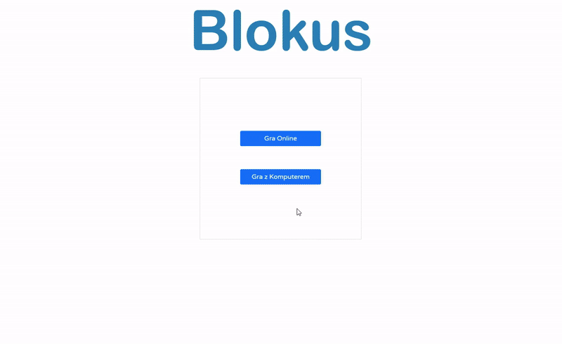

## Multiplayer Blokus Game built with React and Node.js + Express.
- Users can play with their friends anonymously via link in 2 player or 4 player games 
- Users can play against ai on multiple difficulty levels in 2 player or 4 player games 
- tech stack React, Node.js, Express, Socket.io, React-Konva, React-router-dom, Web Workers API

live demo https://blokus-react-frontend.onrender.com/

Ai is implemented based on heuristic and mini-max algorithms

source code is private because it is my engineering project for bachelor's degree but it can be shared for recruitment purposes.

the hosting turns off server after 15 minutes of idle time, that is why lobby creation propably won't work the first time you enter
